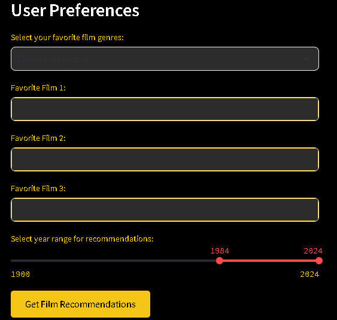
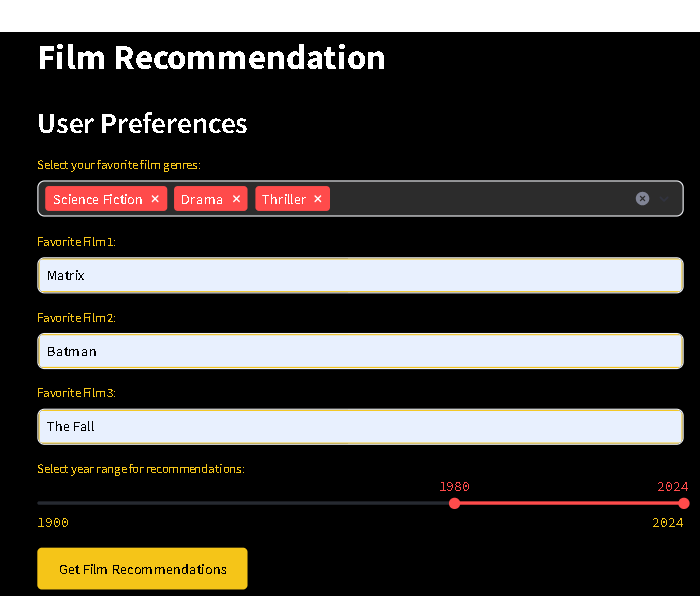
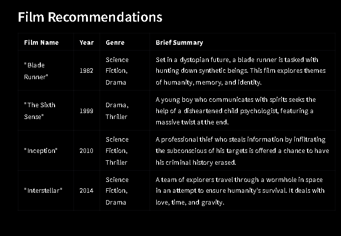

# 🎥 Film Recommendation App

This is a **Film Recommendation Web App** built with **Streamlit** and powered by OpenAI's GPT API. The app suggests movies based on user preferences such as favorite genres, films, and year range.

---

## Features

- **Genre Selection**: Choose your favorite film genres.
- **Favorite Films Input**: Add up to three favorite movies.
- **Year Range Slider**: Specify a year range for recommendations.
- **AI-Powered Suggestions**: Get movie recommendations tailored to your preferences.
- **IMDb-Like Styling**: Custom CSS for a professional look.
- **Save Recommendations**: Outputs recommendations in a markdown table and saves them as a file.

---

## Preview

  

---

## Installation & Setup

1. **Clone the repository**:
    ```bash
    git clone https://github.com/csm34/UPSchool-FilmRecommendation.git
    cd UPSchool-FilmRecommendation/FimRecommendation
    ```

2. **Install dependencies**:
    Ensure you have Python installed, then run:
    ```bash
    pip install -r requirements.txt
    ```

3. **Set up OpenAI API**:
    - Create a `.env` file in the root directory.
    - Add your OpenAI API key:
      ```plaintext
      OPENAI_API_KEY=your_api_key
      ```

4. **Run the app**:
    ```bash
    streamlit run films.py
    ```

5. **Access the app**:  
   Open the link displayed in the terminal (e.g., `http://localhost:8501`).

---

## Usage Instructions

1. Open the app in your browser.
2. Select your favorite genres from the dropdown.
3. Enter up to three favorite films.
4. Adjust the year range slider for the recommendations.
5. Click **"Get Film Recommendations"** to see your movie suggestions.
6. View the recommendations in a markdown table format and download them as a file.

---

## Customization

### OpenAI Integration
This app uses OpenAI's GPT API to generate recommendations. Ensure your API key has sufficient credits to run the application.

---

## Example Output

*Examples of user inputs and the resulting film recommendations.*

<div style="display: flex; justify-content: space-between;">
  
  
</div>

---

## Acknowledgments
- Python | Streamlit
- OpenAI
